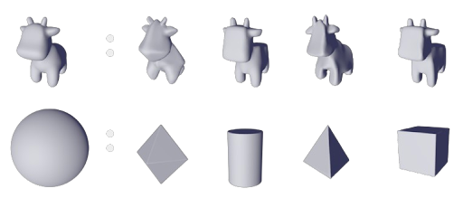
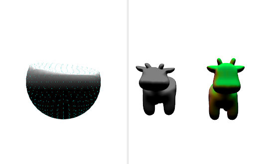

# Shape Analogy

[Slides](https://docs.google.com/presentation/d/1cTYOis6NETxPzF3Cs74sYKzmEXz2Hv_l5aH4MAjHZA4/edit?usp=sharing)



Shape Analogy is an implementation of normal-driven spherical shape analogies (as described by [this paper](https://arxiv.org/pdf/2104.11993)), wrapped in a custom-built interactive editor that supports:

1. As-Rigid-As-Possible ([ARAP](https://igl.ethz.ch/projects/ARAP/arap_web.pdf)) surface deformation
1. Plane pushing
1. Mesh hammering
1. Symmetric edits



## Getting Started

Clone the repository and initial submodules.

```bash
git clone https://github.com/alexander-ding/shape-analogy
cd shape-analogy
git submodule update --init --recursive
```

Build with QtCreator.

To run the interactive editor with sphere normal mapping,

```bash
./shapeshifters -a meshes/sphere.obj -b meshes/spot.obj -s true
```

To run the shape analogy with nearest normal snapping

```bash
./shapeshifters -a meshes/cube.obj -b meshes/spot.obj -s false
```

## Credits

Made by Alex Ding, Jean Yoo, Neil Xu for Brown University's CSCI 2240, in spring 2024.
