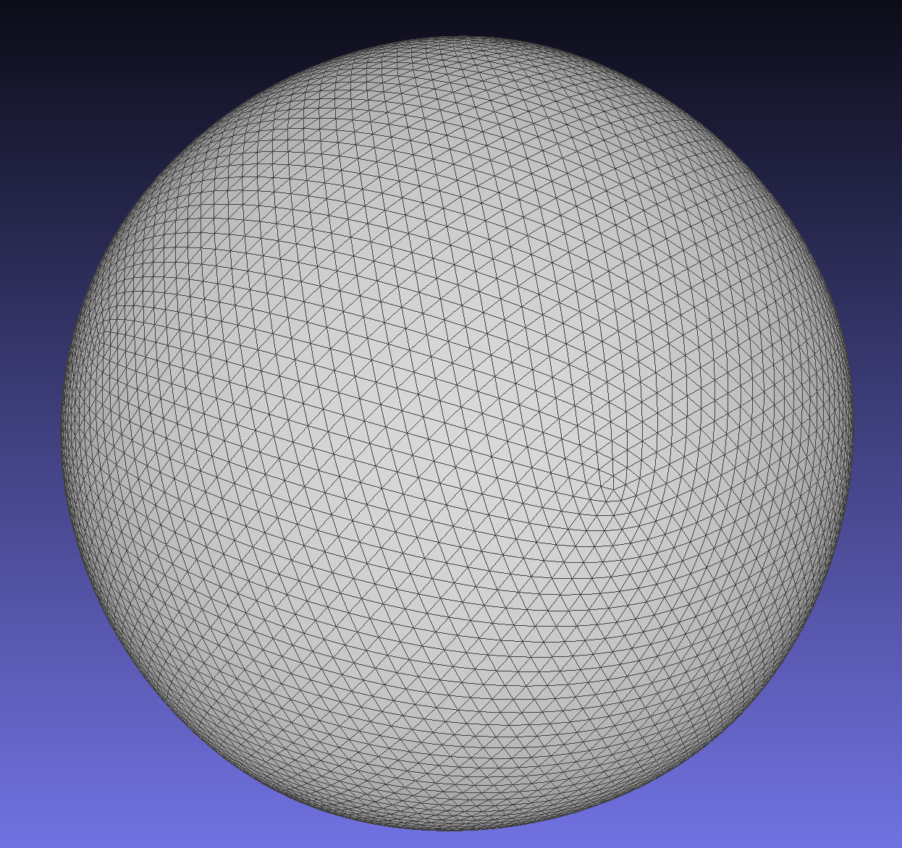
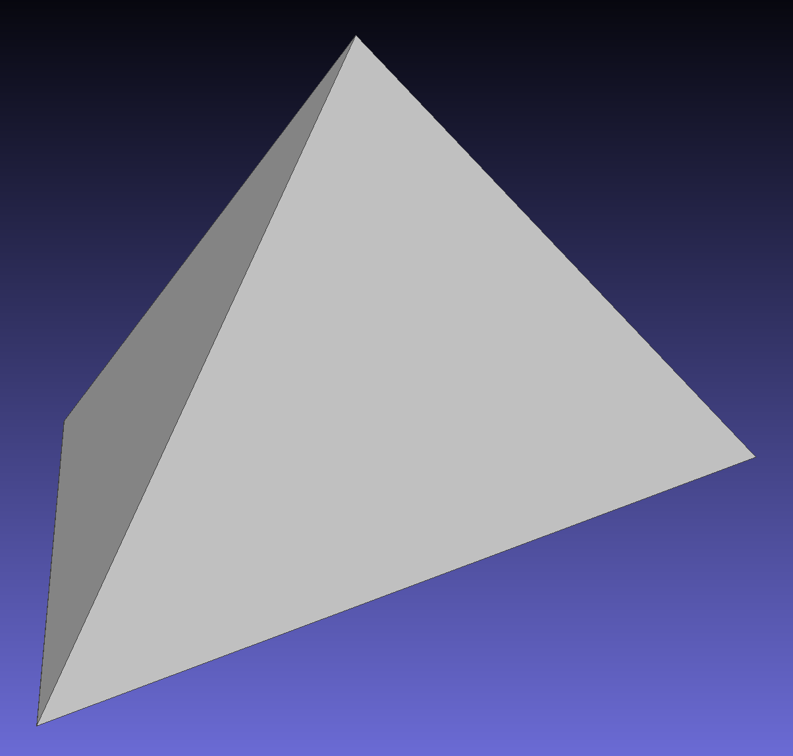
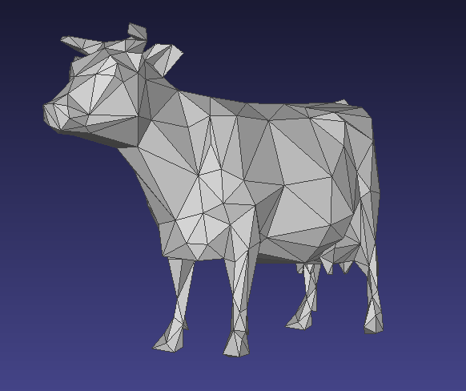
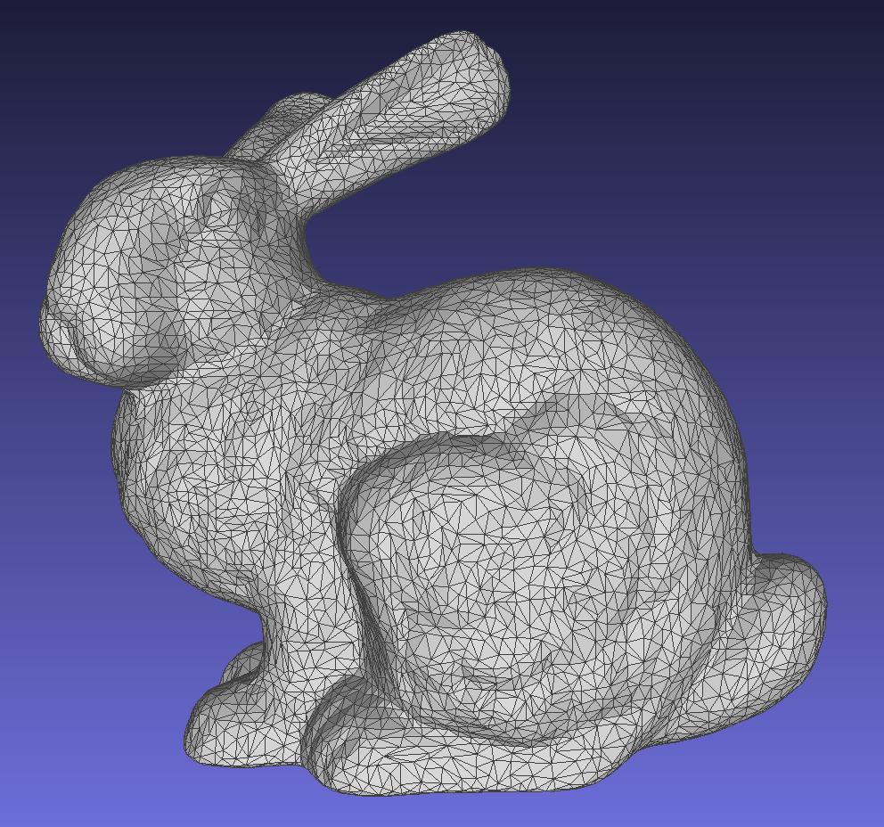
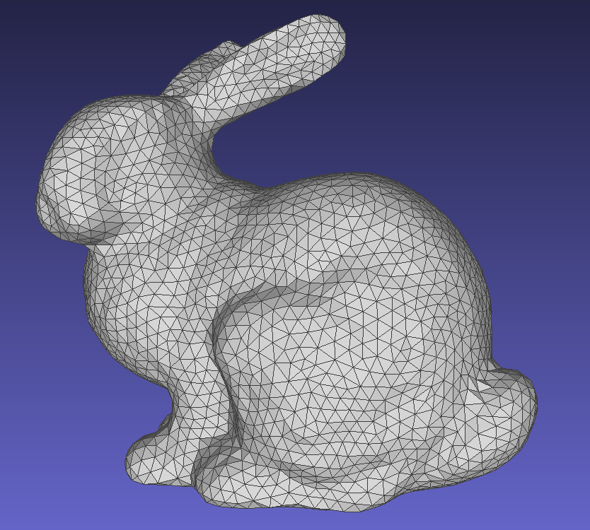
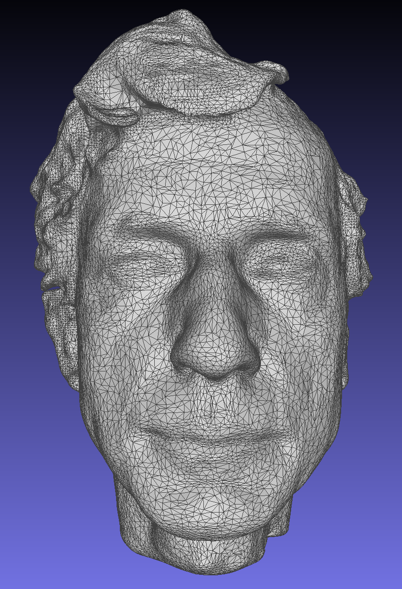
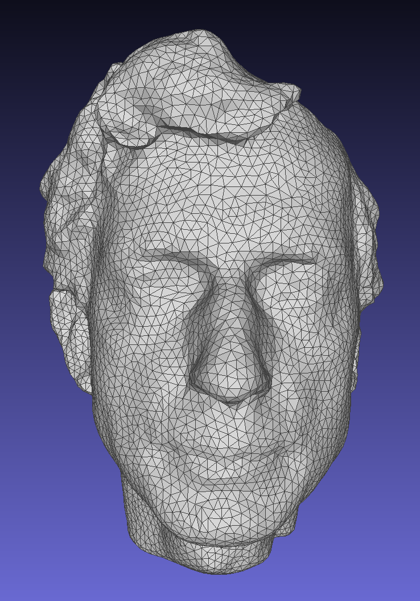

## Mesh (final submission)

Please fill this out and submit your work to Gradescope by the deadline.

### Output Comparison
Run the program with the specified `.ini` config file to compare your output against the reference images. The program should automatically save the output mesh to the `student_outputs/final` folder. Please take a screenshot of the output mesh and place the image in the table below. Do so by placing the screenshot `.png` in the `student_outputs/final` folder and inserting the path in the table.

- For instance, after running the program with the `subdivide_icosahedron_4.ini` config file, go to and open `student_outputs/final/subdivide_icosahedron_4.obj`. Take a screenshot of the mesh and place the screenshot in the first row of the first table in the column titled `Your Output`.
- The markdown for the row should look something like `| subdivide_icosahedron_4.ini |   |  |`

If you are not using the Qt framework, you may also produce your outputs otherwise so long as the output images show up in the table. In this case, please also describe how your code can be run to reproduce your outputs.

> Qt Creator users: If your program can't find certain files or you aren't seeing your output images appear, make sure to: 
> 1. Set your working directory to the project directory
> 2. Set the command-line argument in Qt Creator to `template_inis/final/<ini_file_name>.ini`

Note that your outputs do **not** need to exactly match the reference outputs. There are several factors that may result in minor differences, especially for certain methods like simplification where equal-cost edges may be handled differently.

Please do not attempt to duplicate the given reference images; we have tools to detect this.

| `.ini` File To Produce Output | Expected Output | Your Output |
| :---------------------------------------: | :--------------------------------------------------: | :-------------------------------------------------: | 
| subdivide_icosahedron_4.ini |   |  |
| simplify_sphere_full.ini |   |  |
| simplify_cow.ini |  |  |

Output for Isotropic Remeshing (Note: if you did not implement this you can just skip this part)
| `.ini` File To Produce Output | Input Mesh .png | Remeshed Mesh .png |
| :---------------------------------------: | :--------------------------------------------------: | :-------------------------------------------------: | 
| [remesh_bunny.ini](template_inis/final/remesh_bunny.ini) |  |  |
| [remesh_peter.ini](template_inis/final/remesh_peter.ini) |  |  |

Output for Bilateral Mesh Denoising (Note: if you did not implement this you can just skip this part)
| `.ini` File To Produce Output | Noisy Mesh .png | Denoised Mesh .png |
| :---------------------------------------: | :--------------------------------------------------: | :-------------------------------------------------: | 
| <Path to your .ini file> |   |  |

Output for any other Geometry Processing Functions (Note: if you did not implement this you can just skip this part)
| `.ini` File To Produce Output | Input | Output |
| :---------------------------------------: | :--------------------------------------------------: | :-------------------------------------------------: | 
| <Path to your .ini file> |   |  |

### Design Choices

#### Mesh Data Structure

I used a halfedge representation.
Each mesh element (halfedge, edge, etc.) has a unique integer ID.
This allows us to create sets and maps of element pointers, using in a custom hash function that compares the underlying integer ID.
This comes in handy when we modify the mesh (creating and deleting mesh elements), as we can be sure that we don't ever have clashes in the sets.

#### Mesh Validator

1. Every halfedge, vertex, edge, and face stored in the linked list should be a valid pointer.
1. Every halfedge, vertex, edge, and face backpoints to the correct position in the linked list.
1. Every halfedge should have a twin whose twin is the halfedge.
1. Every halfedge's twin should be different than the halfedge itself.
1. Every halfedge should link back to itself via exactly three next pointers (forming a triangle).
1. Every vertex's halfedge should point back to the vertex.
1. Every edge's halfedge should point to the edge.
1. Every edge's halfedge's twin should point to the edge.
1. Every face's halfedge should point back to the face.
1. Every face's halfedge's next halfedge should point back to the face.
1. Every face's halfedge's next next halfedge should point back to the face.
1. Every single pointer points to an address stored in the corresponding linked list (no untracked elements).

#### Run Time/Efficency

All of our edge operations (edge flip, edge split, and edge collapse) are constant time, thanks to our half edge representation.

For loop subdivision, each iteration:

1. Splits each edge (O(E))
2. Flips some new edges (O(E))
3. Computes a new vertex coordinate for each vertex, by building up a Vertex* unordered_map (O(V), amortized)

The total runtime is O(n(E+V)) for n iterations.
This is pretty efficient!

For mesh denoising, we:

1. Build quadric error matrices for each vertex (O(V))
1. Build up an ordered set of edge errors (to use as a priority queue); we use an ancillary unordered_map from Edge* to the actual error to enable efficient error updates (O(E log(E)))
1. For each iteration, we get a candidate edge, collapse it (trying the next edge if we cannot collapse it; we assume a small constant number of such problems before we hit an edge we can collapse), remove the deleted edges from the queue, and update each neighboring edge's error and remove/reinsert them into the ordered set (again, we assume a small constant degree for each vertex) (O(log(E)) per iteration, or O(E log(E))).

In total, we have O(V + E log(E)), which is within the efficiency requirements.

For isotropic remeshing, we do the following in each iteration:

1. Compute the average edge length (O(E))
1. Collapse and split edges below or above the threshold (O(E))
1. Flip edges that improve valence (note that the effect of flipping an edge on the total valence from 6 can be computed in constant time) (O(E))
1. Compute the face normals and vertex centroids & normals via unordered maps (O(V))
1. Update the vertex position for each vertex (O(V))

In total, we have O(n(E+V)).

### Collaboration/References

Mandy was a homie at TA hours thank you

### Known Bugs

N/A
